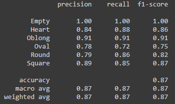

# fsdtorch
Simple package for face shape detection.

Installation:
```
pip install fsdtorch
```

Example usage:
```py
from fsdtorch import inference
import cv2
image_path = "example.jpg"
image = cv2.imread(image_path)
image_rgb = cv2.cvtColor(image, cv2.COLOR_BGR2RGB)
class_id, class_name, confidence = inference.predict_shape(image_rgb)
print(class_name, confidence)
```

I have fine-tuned a pre-trained `InceptionResnetv1` model from [`pytorch-facenet`](https://github.com/timesler/facenet-pytorch) with cropped version of [face shape dataset](https://www.kaggle.com/niten19/face-shape-dataset) from [kaggle](https://www.kaggle.com).

Another example script can be found in `examples` for live shape detection.

<<<<<<< HEAD
Inference is made by using exported `onnx` version of the model and `onnxruntime`.

Final training report:


=======
Inference is made by using exported `onnx` version of the model and `onnxruntime`. 
>>>>>>> 5930537cead9a64263034f4b9227b95cd40443e1
